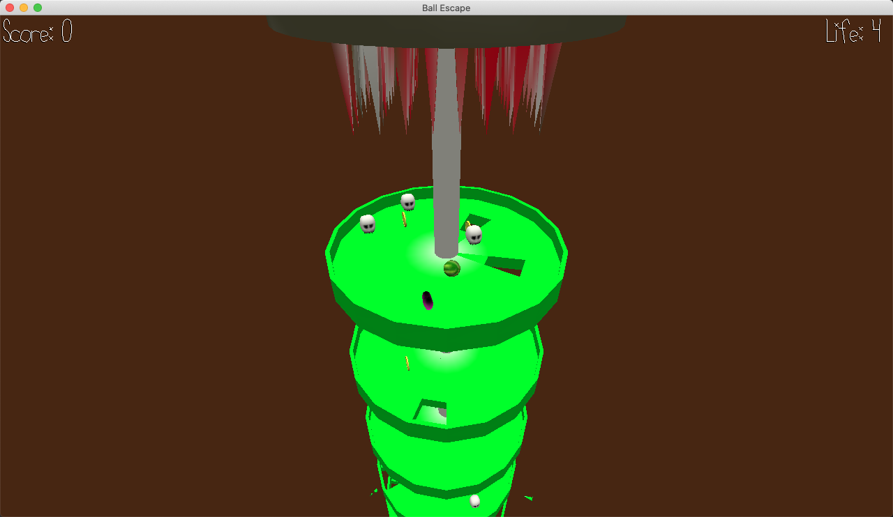

# Ball Escape

Author: Jiasheng Zhou \<jiashen2@andrew.cmu.edu\>
        Hao Wang \<haowang2@andrew.cmu.edu\>

Design:
It's a physic-based ball escape game where player control a ball and try to drop through the hole to escape from the death machine.

Screen Shot:

How To Play:

Controls:\
A: Camera move left\
D: Camera move right\
Arrow keys: Control the ball.\

Goal:\
Survive as long as possible and achieve the highest score.

This game was built with [NEST](NEST.md).

# Resources

Heart:
https://www.turbosquid.com/3d-models/obj-love-heart/1050666 License: https://blog.turbosquid.com/turbosquid-3d-model-license/

Coin:
https://www.cgtrader.com/free-3d-print-models/hobby-diy/hand-tools/3d-printable-5-coins-batman-ottoman-pokemon-mario-x2 (License: https://www.cgtrader.com/pages/terms-and-conditions#royalty-free-license)